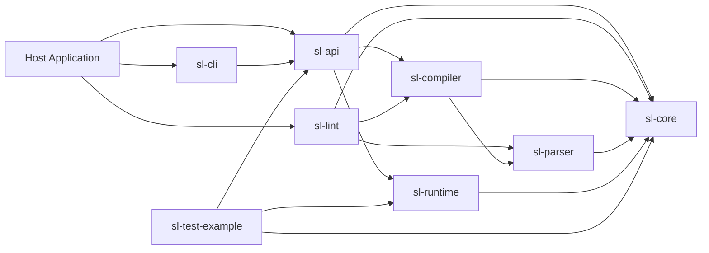
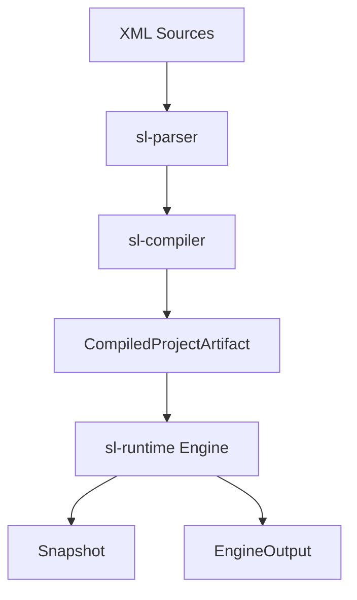

# scriptlang-rs Architecture

This document is the single place for workspace architecture: crate roles, dependency direction, internal boundaries, and compile/run data flow.

## Architecture Goals

- Decouple parser, compiler, runtime, and host entry points.
- Keep dependency direction one-way and predictable.
- Expose only stable host-facing surfaces.

## Workspace Crates

- `crates/sl-core`: shared types, values, errors, snapshot/player schemas.
- `crates/sl-parser`: XML parser and import directive extraction.
- `crates/sl-compiler`: import graph validation, module/script compilation, artifact generation.
- `crates/sl-runtime`: execution engine (`next/choose/submit_input/snapshot/resume`).
- `crates/sl-api`: high-level host API that composes compile + runtime.
- `crates/sl-cli`: host-side CLI (`agent` and `tui` modes).
- `crates/sl-lint`: standalone ScriptLang lint CLI.
- `crates/sl-test-example`: example integration tests and testcase runner.

## Public Surface

Recommended and stable entry points:
- `sl-api`
- `sl-cli`
- `sl-lint`

Internal implementation crates:
- `sl-core`
- `sl-parser`
- `sl-compiler`
- `sl-runtime`
- `sl-test-example`

## Dependency Direction

Required direction:
1. `sl-core` is the bottom layer.
2. `sl-parser` depends on `sl-core`.
3. `sl-compiler` depends on `sl-parser` and `sl-core`.
4. `sl-runtime` depends on `sl-core`.
5. `sl-api` composes `sl-compiler`, `sl-runtime`, and `sl-core`.
6. `sl-cli` orchestrates through `sl-api` only.
7. `sl-lint` depends on `sl-compiler`, `sl-parser`, and `sl-core`.
8. `sl-test-example` depends on `sl-api`, `sl-runtime`, and `sl-core` for integration tests.

## Architecture Diagram

## Compile and Run Flow

Preferred host flow is two-step:
1. Compile XML sources into `CompiledProjectArtifact`.
2. Start or resume engine from that artifact.

Key APIs:
- compile: `compile_artifact_from_xml_map`
- start from artifact: `create_engine_from_artifact`
- resume from artifact: `resume_engine_from_artifact`

`create_engine_from_xml` remains a convenience wrapper over `compile -> artifact -> run`.

## Internal Module Layout

- `crates/sl-cli/src`:
  `lib.rs` coordinates modules; CLI logic is split into
  `cli_args.rs`, `models.rs`, `source_loader.rs`, `state_store.rs`, `session_ops.rs`,
  `boundary_runner.rs`, `line_tui.rs`, `error_map.rs`, `agent.rs`, and `tui.rs`.
  Ratatui internals are separated into `tui_state.rs`, `tui_actions.rs`, and `tui_render.rs`.
- `crates/sl-runtime/src`:
  public entry is `lib.rs -> engine/mod.rs`; engine logic is split into
  `engine/lifecycle.rs`, `step.rs`, `boundary.rs`, `snapshot.rs`, `frame_stack.rs`,
  `callstack.rs`, `control_flow.rs`, `eval.rs`, `scope.rs`, `once_state.rs`, `rng.rs`.
  Helpers are in `helpers/value_path.rs` and `helpers/rhai_bridge.rs`.
- `crates/sl-compiler/src`:
  pipeline is split into `artifact.rs`, `context.rs`, `pipeline.rs`, `source_parse.rs`,
  `import_graph.rs`, `module_resolver.rs`, `error_context.rs`, `type_expr.rs`,
  `sanitize.rs`, `script_compile.rs`, `xml_utils.rs`, `macro_expand.rs`, and `defaults.rs`.
